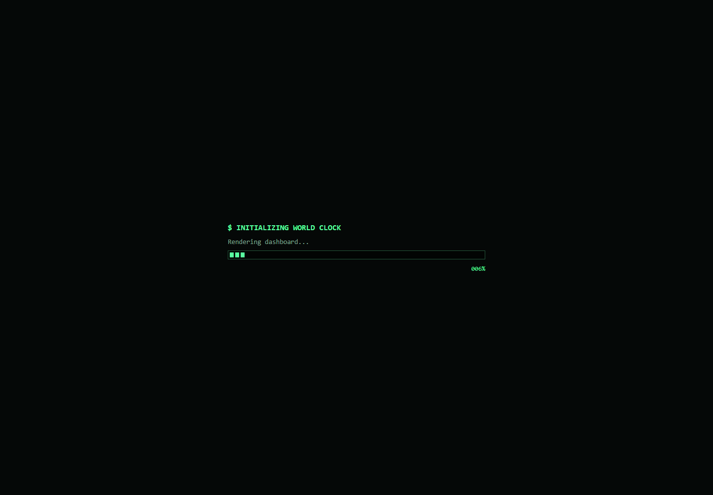

# World Clock Dashboard

A customizable world clock dashboard built with Next.js, React, TypeScript, and Leaflet. It is designed for desktop dashboards, wall displays, and presentation mode.

## Preview



## Features

- Search for cities and countries worldwide.
- Reorder clock cards with drag and drop.
- Customize card colors, typography, theme, UI style, and grid layout.
- Save clocks and preferences locally between browser sessions.
- Use an interactive map to inspect the local time at any location.
- Configure the map's default city and zoom level.
- Run a distraction-free fullscreen presentation mode.
- Update clocks locally every second without polling a time service.

## Requirements

- Node.js 20.9 or newer
- npm 10 or newer

## Getting started

```bash
npm install
npm run dev
```

Open `http://localhost:3000`.

For a production build:

```bash
npm run check
npm start
```

## Scripts

| Command | Purpose |
| --- | --- |
| `npm run dev` | Start the development server on port 3000 |
| `npm run typecheck` | Validate TypeScript without emitting files |
| `npm run build` | Create an optimized production build |
| `npm run check` | Run the typecheck and production build |
| `npm start` | Serve the production build on port 3000 |

## Project structure

```text
app/
├── hooks/                 Reusable React hooks
├── lib/                   Domain types, constants, formatting, and services
├── LeafletWorldMap.tsx    Client-side interactive map
├── page.tsx               Dashboard UI and state orchestration
├── layout.tsx             Application shell and metadata
└── globals.css            Theme and component styles
```

## Data and privacy

Dashboard preferences are stored only in the browser's `localStorage`. City search uses Open-Meteo's geocoding service. Map tiles come from OpenStreetMap, coordinate timezone resolution uses TimeAPI with an Open-Meteo fallback, and map-selected time is synchronized using [Time.Now](https://time.now/). No API credentials are required.

Map data is © [OpenStreetMap contributors](https://www.openstreetmap.org/copyright) and displayed with [Leaflet](https://leafletjs.com/). Keep the on-map OpenStreetMap attribution visible when redistributing the application.

## Deployment

The application can run on any platform that supports Next.js and Node.js. Both development and production servers bind to `0.0.0.0:3000`, which also makes the project suitable for a Raspberry Pi or local-network display.

## Contributing

Bug reports and pull requests are welcome. Read [CONTRIBUTING.md](CONTRIBUTING.md) before submitting changes. Please report security issues using the private process in [SECURITY.md](SECURITY.md).

## License

Released under the [MIT License](LICENSE).
